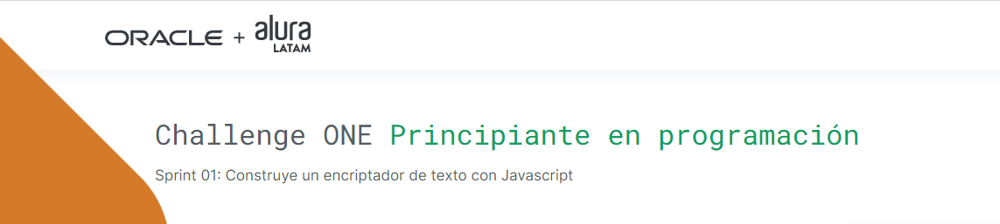
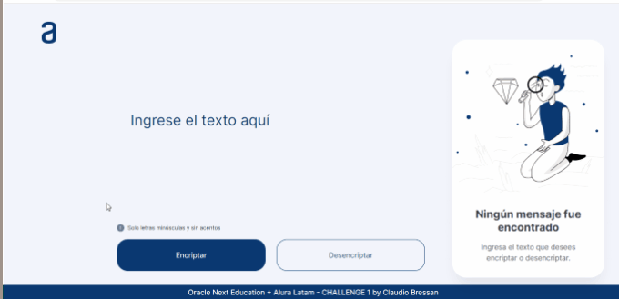
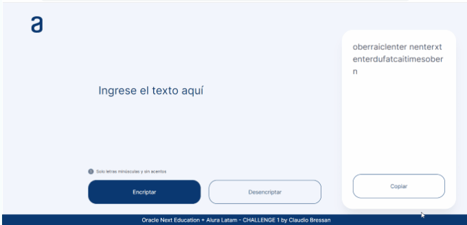

 
   
   
   

---

## Descripción
#### El objetivo de este challenge es poner en práctica lo aprendido en la primer estapa del programa **ONE**.
---
## Funcionalidades
  
 - **`encriptar`**: el usuario introduce un texto en el campo destinado a ese efecto, hace clic en el *botón encriptar* y el resultado de la encriptación aparece en el área de la derecha.  

   
 - **`desencriptar`**: se puede copiar en resultado de la encriptación con el botón que aparece del lado derecho o es posible escribir o pegar otro texto encriptado, una vez hecho esto, tras hacer clic en el *botón desencriptar*, en resultado es mostrado nuevamente en el lado derecho.
 

##### this is for you ...

> *menter gufatstairimesai enterstair entern enterl enterqufatimespober
enterspenterrober tufat coberntaictober*

&nbsp;
### Puedes acceder al site, haciendo clic [**aquí**](https://Claubress.github.io/ONE-Alura-Challenge01/)
---
## Tecnologías utilizadas

---
## Autor
[ Claudio Bressan](https://github.com/Claubress) |
 :---: |